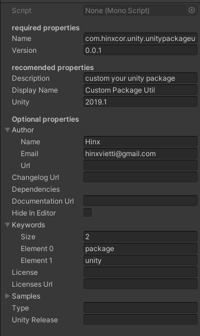

# Unity Package Manifest (custom package)

## Creating custom packages

The Unity Package Manager is the official package management system for Unity. It does the following:

- Allows Unity to distribute new features and update existing features quickly and easily.
- Provides a platform for users to discover and share reusable components.
- Promotes Unity as an extendable and open platform.

You can use the Package Manager to define project **dependencies**``
, resolve package dependencies, download and add packages as needed, and integrate content in your projects.

For general information on what a package is and how the Unity Package Manager works, see the [Packages](https://docs.unity3d.com/Manual/Packages.html)
 documentation.

## Package manifest Util

### usage

```C#
     public static void Test()
        {
            var package = new Package
            {
                name = "com.hinxcor.unity.UnityPackageUtil".ToLower(),
                version = "0.0.1",
                description = "Custom Package Tools",
                displayName = "Custom Package (Hinx)",

                author = new Author { name = "hinx", email = "hinxvietti@gmail.com" },

                license = "license.md"
            };

            string json = package.ToString();
            Debug.Log(json);
        }
```

### result (json)

```json
{
    "name": "com.hinxcor.unity.unitypackageutil",
    "version": "0.0.1",
    "description": "custom your unity package",
    "displayName": "Custom Package Util",
    "unity": "2019.1",
    "author": {
        "name": "Hinx",
        "email": "hinxvietti@gmail.com"
    },
    "hideInEditor": false,
    "keywords": [
        "package",
        "unity"
    ],
    "samples": []
}

```

### Scriptable (edit in hierarchy)



### Package Manager View


